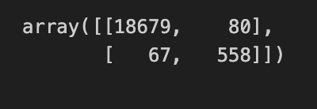
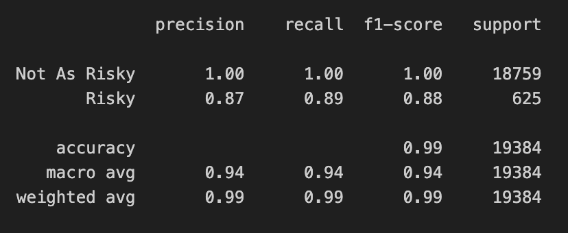

# Module 20 Report

## Overview of the Analysis
The purpose of this analysis was to create a model using supervised learning methods to predict creditworthiness based on past credit history. The model and analysis were completed in Python using Sci-Kit Learn. Pandas was used to bring in the data.
 
The dataset includes the following metrics:
   * `loan_size`
   * `interest_rate`	
   * `borrower_income`	
   * `debt_to_income`	
   * `num_of_accounts`	
   * `derogatory_marks`	
   * `total_debt`	
   * `loan_status`
    

The variable that the model was designed to predict was the status of a loan. Is the account in good standing or not? After training the model on about 70% of the dataset, it was then tested with the remaining 30% of the dataset to assess the model's performance.

## The Supervised Learning Process
The dataset was separated into labels (`loan_status`) and into a features DataFrame(the remaining columns within the dataset). The DataFrame was split into training and testing data using `train_test_split` and fit with LogisticRegression.

A classification report was generated using the classification_report package within Sci-Kit Learn. The important metrics to note here are as follows:
* `Accuracy`: Percent of accounts that the model correctly classifies as being risky or not
* `Precision`: Percent of accounts that the model correctly classifies out of all accounts with the same predicted classification
    * e.g.: Of all accounts that were predicted to be risky, how many actually were risky?
* `Recall`: Percent of accounts that are known to be risky or not that were correctly identified as such
    * e.g.: Of the actual risky accounts, how many were identified as being risky by the model?

## Results
## Reading the Confusion Matrix
A confusion matrix shows the number of accounts from the testing data that the model classified. Below are the definitions for what each metric represents in the matrix and the results of that matrix follows.

* `upper left`: Accounts correctly classified by the model as being in good-standing
* `upper right`: Accounts classified by the model as being risky, but actually are in good-standing (i.e.: false positives)
* `lower left`: Accounts classified by the model as being in good-standing, but actually are risky (i.e.: false negatives)
* `lower right`: Accounts correctly classified by the model as being risky

## Reading the classification report for the model:
Below is the resulting classification report for the model

The classification report advises that the model is nearly 99% accurate when making predictions of creditworthiness.

The model does fairly well when predicting accounts that are in good standing, being close to 100% in both precision and recall. The story changes when predicting risky accounts.

The recall for risky acounts is higher than the respective precision, meaning that, although the risky accounts are being identified, the model is predicting more false positives than it should. In other words, risky accounts are being missed and are being classified as not being as risky as others.

## Summary

A model's performance importance does depend on the problem that it is being used to solve. For example, if the goal here was to create a model for accounts that are in good standing, it wouldn't be as useful since it appears that MOST accounts that were sampled are in good standing and there are very few implications or consequences if a person was improperly labeled as being a risky credit consumer. However, when predicting the risky accounts, performance would be important since that is where a credit lender would suffer financial consequences if the model had very low performance.

Here, the model seems to be fairly dependable and could likely be improved if possibly other factors were being considered, such as various lifestyle metrics. Examples could include where or not a person has higher education, own a home, or something as detailed as having children or not.
